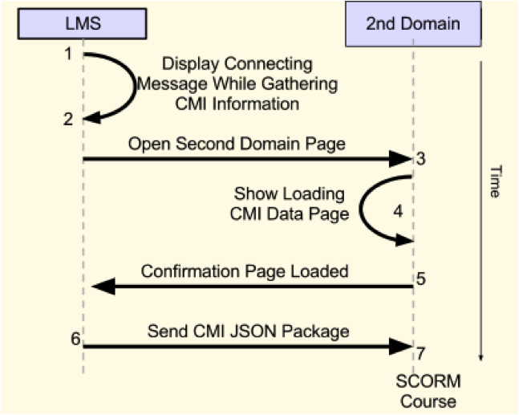

Augmenting a SCORM Course to Communicate Across Domains
======================

Alex Villaneda-van Vloten, Programmer	
[@pituki](http://twitter.com/pituki)  
Kaseman International				
1600 Tysons Blvd  McLean, VA 22102

Gregory D. Fletcher II, Programmer  
[@havokjinx](http://twitter.com/havokjinx)  	
Alutiiq Native Corporation  
8619 Westwood Center Dr, Vienna, VA 
22182

[Presentation Slides](http://goo.gl/XA0B6)

##Abstract
This presentation describes our solution to providing both open and controlled online training content for one course hosted through an open Learning Management System. This solution also applies to anyone needing an LMS linking to content hosted in multiple domains. SCORM functionality had to be maintained even though the controlled content could be accessed only when logged into the secure domain. Hosting domains had to report all interactions to the same LMS. 

We developed a communication channel which allowed different domains to communicate SCORM data. Using postMessage.js and the SCORM API, JSON objects could be sent from a secured network to a script in the LMS that converted the objects back into SCORM API calls. This method allowed for coordination of communication between public and privileged domains. SCOs can be hosted between multiple domains and report SCORM Data Model Elements back to the same course within an LMS. A template script will be offered to attendees.

##The Problem

We developed a Computer Based Training(CBT) composed of a series of modules.  Two of the modules in the CBT required to be hosted in a private domain because of the nature of the content.  

The idea was raised to host the content in two separate places, through two separate courses.  One for basic internet access and other for privileged access,  resulting in separate grades for every student.  A grading metric would have to be compiled in order to maintain a standard for passing the course by calculating the outcome of multiple reports.  This method would prove to be an arduous task requiring registrar time and attention for every duration of the course.  The student interaction would require self-tracking of progress in multiple courses to ensure that the completion of all modules is accurately reported on his/her transcript.  The proposed method was found to be problematic and perplexing in all aspects of administration and user experience.

##Constraints
The constraints did not become apparent until halfway through the development of the course as 2 new modules were added to the project. The course had many obstacles to overcome.  The task was as follows:

-  The course would have international visibility
-  Some modules in the course contained privileged information and should not be available to the internet but still had to be tracked
- The course must work with a baseline of Internet Explorer v. 7.10
- The LMS team had experience a withering tormentous failure(WTF) on previous ocation
- The development team had no direct access to the backend of the LMS

##The Solution

The solution came to us in the form of client javascript, no server backend was changed. As we explained the solution to the upper management we came up with a simile. The simile was in the form of a hamburger, it describes the layers of our approach to solve this problem. Each layer is explained as follows:

- Top Bun - LMS
- Lettuce - LMS SCORM API
- Mayo - Client API @LMS
- Meat - connectivity between LMS iframe and Remote static server
- Mustard -  Our Replacement API 
- Bottom Bun - Course Content (HTML)

Each layer of the hamburger is a communication mechanism either for api interaction or JSON communication, explained below. 

##Top Bun (LMS)

The LMS implements the SCORM API. Our solution is divided into two packages that are placed in two places: the LMS(Top Bun) and a privileged domain (Bottom Bun).  The LMS functions as are not altered in any way.  Essentially, the LMS is oblivious to the fact that the LMS api is being replicated and used elsewhere.  Course development processes remain unchanged. 

##Lettuce (LMS SCORM API)

We utilized a headless course that will launch the remote course content.  By headless course, we mean that the content is not in the LMS SCO, the only element that was packaged was an HTML document with a frame pointing to the second domain (in our case MS SharePoint). This layer of our Hamburger approach consists of a series of handshakes between the LMS SCORM-based API and the domain mock API.

##Mayo (LMS Client API) 


This layer represents the stub course we upload to the lms. This stub course contains the SCO that will launch the remote course. This SCO consisted of 2 basic pages; the first one is an html page with a frame, the second one is a page displaying a message to wait while communications are enabled.  The frame page contains an important part of the communication. The frame has 2 states: state one this frame collects all information it can from the LMS. it goes over all the API calls and creates a copy of the CMI object. This CMI object will be sent over to the private network course page. The CMI object takes the form of a JSON object. sample:

```
{
  CMI:{
    core:{
      _children:””,
      student_name: “John Smith”,
      …
    }
  }
}
```

##Meat (Communication Channel)

The meat is the channel by which all communication passes between the LMS side ( mayo lettuce and bun). This happens in different ways for different browsers. Most newer browsers use cross-document-messaging, older browsers like IE7 and below communicate through the url using hash tags, the message gets sent over the URI. The meat takes JSON to and from 
mayo and mustard.

Most modern browsers support cross-domain scripting through the browser window.postmessage function.  A major constraint to the window.postmessage functionality is that it is not supported older browsers.  PostMessage.js is a javascript library that simplifies the communication implementation between iframes.  In this project, we utilize this functionality to send CMI data between the lms domain and private network.

##Mustard (Mock API)

The Mustard lies on the private MS SharePoint site. the mustard acts as if it were the LMS, it receives the CMI(Computer Managed Interaction) object from the salad and implements the SCORM API. The remote course thinks the Mustard is an LMS and interacts with it to get and set CMI information. The mustard will not load the course until it has received the CMI object. If the mustard has not received the CMI object the mustard displays a page indicating that communications are being established. Below we describe the initial handshake between LMS and private network:



1. In order to properly equip the communication API with accurate data, the SCO will launch an HTML page (index.html:LMS) that will become a pertinent part of the communication between the layers.
2. The LMS HTML (index.html:LMS) will open up (loading.html:LMS). The reason was for letting the user know something was happening.
3. The LMS HTML (index.html:LMS) will load CMI data and load (index.html:PrivateDomain).
4. (index.html:PrivateDomain) will automaticaly load (loading.html:PrivateDomain) in its frame. Displaying message about communication being established.
5. (index.html:PrivateDomain) will send a message back to (index.html:LMS) specifying that it has loaded and it is readdy for data.
6. (index.html:LMS) sends CMI JSON Package to (index.html:PrivateDomain).
7. (index.html:PrivateDomain) instantiates the SCORM API and loads the SCORM course.

##Bottom Bun (Course Content)

In our case, the bottom bun was a private MS SharePoint intranet. The Bottom Bun could be any static server hosting course content.  A decentralized course allows for course content to be modularized in different networks.  With some applications, a course could have certain chapters hosted in a public domain while others require some form of authentication. 

A great example where our approach can be used is: Two departments can manage their content indepently of each other while maintaining the structure of a single course.  This technique will save integration time when creating a course for deployment through an LMS.  Also, this technique is completely ambiguous to the customer or student.

#Hungry?

Our constraints created obstacles that were not overcome by previous teams. We took an ordinary LMS and converted it into a distributed LRS. We are able to have a single course with content hosted in multiple locations while reporting back to a single LMS.  We created a SCORM API and a client API, just as if it they were electrical adaptors that plug into each other and establish a communication medium between them. Utilizing cross-site scripting for IE7 and cross-document messaging for newer browsers, we created a solution. 

#References

(2001). Shareable Content Object Reference Model (SCORM) version 1.2 run-time environment (rte) . Advanced Distributed Learning. Retrieved from <http://www.adlnet.gov>

Daepark. (n.d.). Postmessage. Retrieved from <https://github.com/daepark/postmessage>

Overton, J. (2013). Window.postmesage. Retrieved from   <https://developer.mozilla.org/en-US/docs/DOM/>window.postMessage 

@Fyrd. (n.d.). Compatibility tables for support of html5, css3, svg and more in desktop and mobile browsers.. Retrieved from <http://caniuse.com/>

Jquery Team. (n.d.). Jquery. Retrieved from <https://github.com/jquery/jquery>

#Glossary

API - Application Programming Interface

CBT - Computer Based Training

CMI - Computer Managed Instruction (<http://support.scorm.com/entries/45875-what-is-cmi>)

LMS - Learning Management System

LRS - Learning Record Store
MS SharePoint - Microsoft SharePoint, Web based Document Management Portal.

SCO - Sharable Content Object

SCORM - Sharable Content Reference Model


